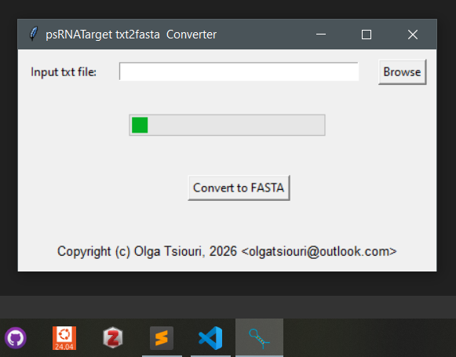

# psrnatarget2fa
Command line or GUI program that retrieves the mRNA target fragments from the psRNATarget output against a single mRNA

# Installation
## Windows
- Download either the gui or the command line x64 app from the `Releases` tab
- Extract zip 
- You can use the gui app directly you can also pin it to start and taskbar
- To use to command line app move it to:

```Powershell
C:\Windows\System32
```
## linux
- To run the command line app download this repo
- Navigate to `src/cmd`
- Convert `psrnatarget2fa.py` to executable:

```Bash
chmod +x psrnatarget2fa.py
```
Add it to PATH:

```Bash
sudo cp psrnatarget2fa.py /usr/bin
```

# Usage
## GUI



- Click `Browse` to navigate to the [input](data/psRNATargetJob-1776680362544351.txt) file
- Click `Convert to FASTA`

## CMD
For windows:

```Shell
psrnatarget psRNATargetJob-1776680362544351.txt
```
For linux:

```Bash
psrnatarget.py psRNATargetJob-1776680362544351.txt
```

**Note: This program assumes you check for target accessibility when running psRNATarget**  
**Note: The output fasta file is stored in the folder where the input file is located**  

Icon was taken by [NanoString University](https://university.nanostring.com/how-to-perform-the-mirna-expression-assay) 

